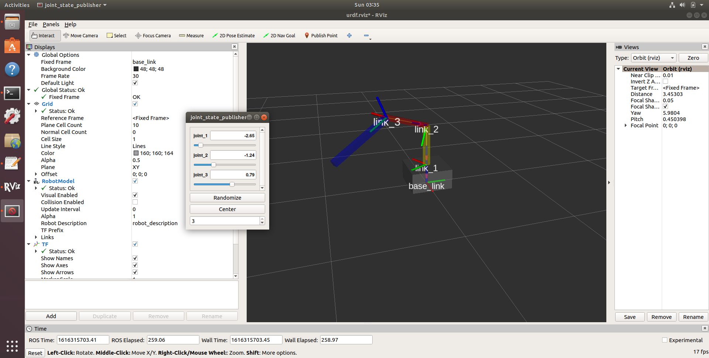

# Creating a 3 Link Robotic Arm Using URDF
> In this exercise, we will build a 3 Link Robotic Manipulator using the Unified Robotic Description Format (URDF). It is an XML file format used in ROS to describe all elements of a robot and can be used to define a robot to its component level. We will then use RVIZ to simulate that robot.

First Let's create a ros package to define the URDF definitions.


 1. Goto your `catkin_ws` and to the `src` folder and create a package 

    ```
    catkin_create_pkg serial_link_robot tf2 tf2_ros roscpp rospy turtlesim
    ```

    then do  `catkin_make` to build the project. Now you have project folder to create URDF

 2. Goto the project folder and build a urdf folder to include the urdf files

    ```
    cd ~/catkin_ws/src/serial_link_robot
    mkdir urdf
    ```

 3. Now lets create our first URDF file. Inside the urdf folder create a file  called                     
    'serial_link_robot.urdf'

    ```
    gedit serial_link_robot.urdf
    ```
 4. Now let's create our first link of the robot. Copy the following xml commands to the 'serial_link_robot.urdf' file..

    ```
     <?xml version='1.0'?>
    <robot name="serial_Link_robot">
      <!-- Base Link -->
      <link name="base_link">
        <visual>
          <origin xyz="0 0 0.1" rpy="0 0 0" />
          <geometry>
          <box size="0.4 0.4 0.2"/>
          </geometry>
          <material name="gray">
          <color rgba="0.5 0.5 0.5 0.5"/>
          </material>
        </visual>
      </link>
    </robot>
     ```
    

    This will create the base link with the dimension 40 cm x 40 cm x 20 cm.

    More information about URDF link elemenr can be found here
    <http://wiki.ros.org/urdf/XML/link>. Try to understand what each of these xml components means.

 5. Now let's create a launch file to display the link in RVIZ. It is a 3D visulaisation software. Fist create a  launch   folder inside the package folder
 
    ```
    cd ~/catkin_ws/src/serial_link_robot
    mkdir launch
    cd launch
    ```

 6. Now let's create the launch file. Inside the `launch` folder create a file called ' serial_link_robot_rviz.launch'.
    
    ```
    gedit serial_link_robot_rviz.launch
    ```

 7. Now add the following launch commands to the `serial_link_robot_rviz.launch` file.

    ```
    <launch>
      <!-- values passed by command line input -->
      <arg name="model" />
      <arg name="gui" default="False" />

    <!-- set these parameters on Parameter Server -->
    <param name="robot_description"
    textfile="$(find serial_link_robot)/urdf/$(arg model)"
    />

    <param name="use_gui" value="$(arg gui)"/>
    <!-- Start 3 nodes: joint_state_publisher,
      robot_state_publisher and rviz -->

    <node name="joint_state_publisher"
      pkg="joint_state_publisher"
      type="joint_state_publisher" />

    <node name="robot_state_publisher"
      pkg="robot_state_publisher"
      type="state_publisher" />


    <node name="rviz" pkg="rviz" type="rviz"
      args="-d $(find serial_link_robot)/urdf.rviz"
      required="true" />
    </launch>


    ```
 8. This roslaunch file performs the following:

    * Loads the model specified in the command line into the Parameter Server.
    * Starts nodes that publish the JointState and transforms.
    * Starts rviz with a configuration file (urdf.rviz).

9.  Now you can run the launch file  by runing the roslaunch command in the terminal


    
    ***roslaunch serial_link_robot serial_link_robot_rviz.launch model:=serial_link_robot.urdf***

    

10.  This will open the  Rviz window.  Click on 'ADD' button (left bottom) and add 'RobotModel' and 'TF' modules. 
     Also, change the 'Fixed Frame' in      Global     Option from map to base_link. This is the global reference frame. 
     Save the rviz file before closing the window.
     
     


11.  Now let's add a joint and another link. More information about URDF joint element can be found here
    <http://wiki.ros.org/urdf/XML/joint>. Its a revolute joint that rotates from -pi to +pi. See how I have added the color to the link. 
    Also, see how I have assigned the origin of the visual component of the link. This is equal to half of the link length.
    Open the urdf file and add the followings before the `</robot> `tag.

        ```  
            <!-- Joint 1 -->
          <joint name="joint_1" type="revolute">
            <parent link="base_link"/>
            <child link="link_1"/>
            <origin xyz="0 0 0.2" rpy="0 0 0" />
            <axis xyz="0 0 1" />
            <limit effort="100.0" velocity="0.5" lower="-3.14"
          upper="3.14"/>
          </joint>

        <!-- Link 1 -->
          <link name="link_1">
            <visual>
              <origin xyz="0 0 0.2" rpy="0 0 0" />
              <geometry>
              <box size="0.05 0.05 0.4"/>
              </geometry>
              <material name="yellow">
               <color rgba="1.0 1.0 0 0.5"/>
              </material>
            </visual>
          </link>    

        ```

12. Now let's display and move the robot. Run the following command in a terminal'

   
    ***roslaunch serial_link_robot serial_link_robot_rviz.launch model:=serial_link_robot.urdf gui:=True***
    

    The `gui` parameter open a joint state publisher window. You can manupulate the robot by chaning the joint slider bars.

    

    
13. Now lets expand the robot to a 3 link manupulator. Let's add more joints links. see the last link configuration. Its in y direction initially

    See the recoded zoom class for the demo. The completed urdf file is shown below.

```
    <?xml version='1.0'?>
    <robot name="serial_Link_robot">
      <!-- Base Link -->
      <link name="base_link">
        <visual>
          <origin xyz="0 0 0.1" rpy="0 0 0" />
          <geometry>
          <box size="0.4 0.4 0.2"/>
          </geometry>
          <material name="gray">
          <color rgba="0.5 0.5 0.5 0.5"/>
          </material>
        </visual>
      </link>

    <!-- Joint 1 -->
      <joint name="joint_1" type="revolute">
        <parent link="base_link"/>
        <child link="link_1"/>
        <origin xyz="0 0 0.2" rpy="0 0 0" />
        <axis xyz="0 0 1" />
        <limit effort="100.0" velocity="0.5" lower="-3.14"
      upper="3.14"/>
      </joint>

    <!-- Link 1 -->
      <link name="link_1">
        <visual>
          <origin xyz="0 0 0.2" rpy="0 0 0" />
          <geometry>
          <box size="0.05 0.05 0.4"/>
          </geometry>
          <material name="yellow">
           <color rgba="1.0 1.0 0 0.5"/>
          </material>
        </visual>
      </link>

    <!-- Joint 2 -->
      <joint name="joint_2" type="revolute">
        <parent link="link_1"/>
        <child link="link_2"/>
        <origin xyz="0 0 0.4" rpy="0 0 0" />
        <axis xyz="1 0 0" />
        <limit effort="100.0" velocity="0.5" lower="-3.14"
      upper="3.14"/>
      </joint>

    <!-- Link 2 -->
    <link name="link_2">
        <visual>
          <origin xyz="0 0 0.25" rpy="0 0 0" />
          <geometry>
          <box size="0.05 0.05 0.5"/>
          </geometry>
          <material name="Red">
           <color rgba="1 0 0 0.5"/>
          </material>
        </visual>
      </link>

    <!-- Joint 3 -->
     <joint name="joint_3" type="revolute">
        <parent link="link_2"/>
        <child link="link_3"/>
        <origin xyz="0 0 0.5" rpy="0 0 0" />
        <axis xyz="1 0 0" />
        <limit effort="100.0" velocity="0.5" lower="-3.14"
      upper="3.14"/>
      </joint>

    <!-- Link 3 -->
    <link name="link_3">
        <visual>
          <origin xyz="0 0.3 0" rpy="0 0 0" />
          <geometry>
          <box size="0.05 0.6 0.05"/>
          </geometry>
          <material name="Blue">
           <color rgba="0 0 1 0.5"/>
          </material>
        </visual>
      </link>

    </robot>
   
```

.

14. You can launch the launch file using the command shown above and manipulate the your Robot arm.

