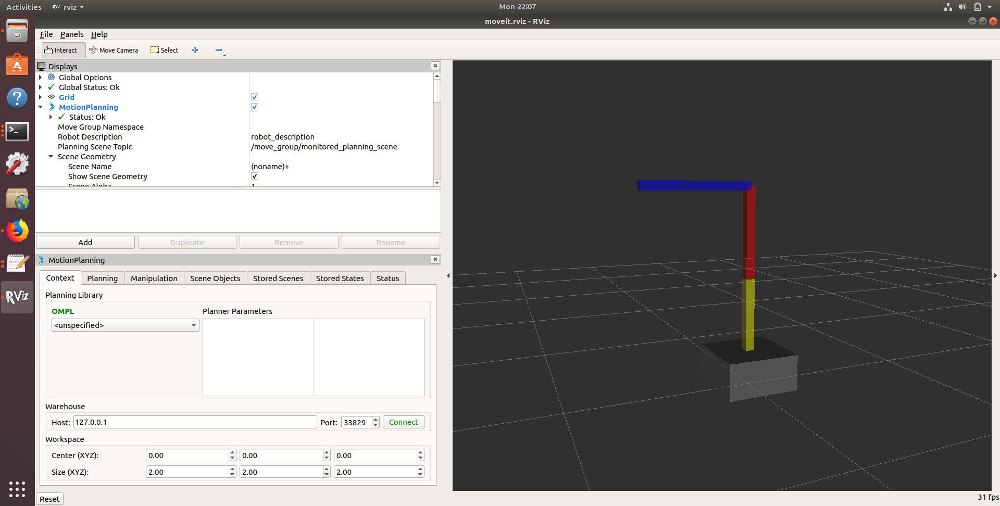
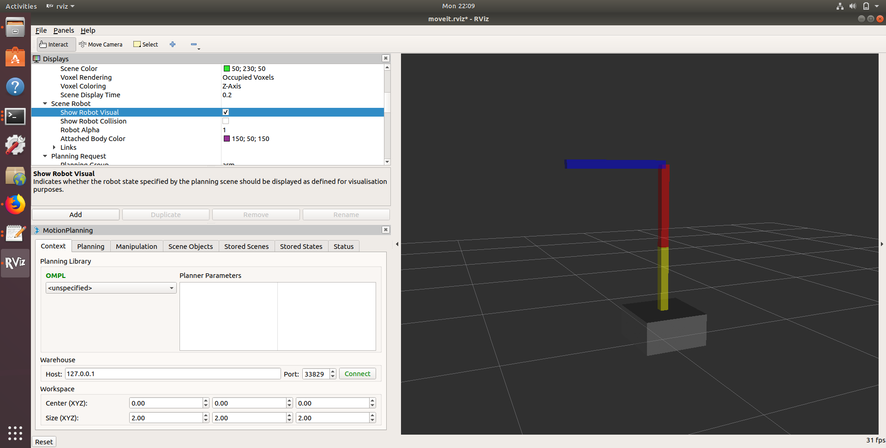
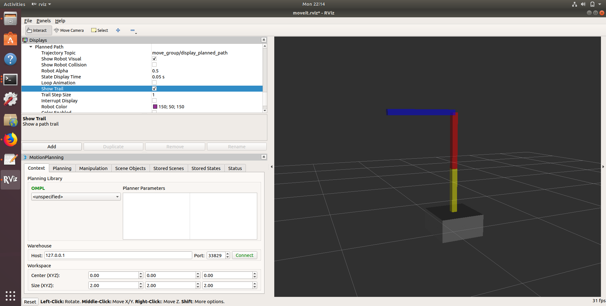

# MoveIt Path planning with python code

In this tutorial, we will learn how to write a python code to move our robot arm to a goal location.

One of the simplest MoveIt user interfaces is through the Python-based Move Group Interface. These wrappers provide functionality for most operations that the average user will likely need, specifically setting joint or pose goals, creating motion plans, moving the robot, adding objects into the environment and attaching/detaching objects from the robot.

## Creating a python script

Make sure that you have completed the previous MoveIt configuration tutorial. Now go to your ``catkin_ws/src/moveit_arm`` folder and create an src folder inside it. Then create the ``move_robot_arm.py`` script inside it.

## Python script

* Download  ``move_robot_arm.py`` file  from the moodle site and copy it to the python file that you created. See below for more explanation of the code.
* Make the python script executable by using the ``chmod`` command.
* Build your project by running the  catkin_make command inside catkin_ws folder. 

## Run and configure RVIZ

In a new terminal run the follwing command to load RVIZ with moveit motion planning GUI.

```
roslaunch moveit_arm  demo.launch

```

Set following setting in RVIZ

* In motion planning panel set ``Planning Scene Topic`` to /move_group/monitored_planning_scene.

* In Scene Robot tick ``Show Robot Visual``

* In Planning request untick Query ``Start State`` and ``Query Goal State``

* In Planned path tick  ``Show Trail``

* In Planned path untick  `` Loop animation``

* save the config by File -> save







   

## Run path planning script


In a new terminal run


```
rosrun moveit_arm move_robot_arm.py 
```

This will ask you to press enter. When you press enter you would see that the arm is moving to the new location. And the path moved is also shown in Rviz. 


## Setting new goals

We can set a new goal location in the ``go_to_pose_goal()``  function. Try to change the goal location by changing the x,y,z values in meters w.r.t. ``base_link``. See how I have set the goal location. If the goal location cannot be reached then a message will display saying that a valid path cannot be found.
```
 # set the new end end effector goal location , w.r.t. base_link in meters
    pose_goal.position.x =  0.3
    pose_goal.position.y = 0.8
    pose_goal.position.z = 0.0


```

## Moving on a Cartisian Path


We can also move the robot end effector in a cartesian path (x,y,z). What we have to do is define a set of way points. 


Download the ``move_robot_arm_path.py`` and run in a terminal after copying it into the ``moveit_arm\src folder``. Make it executable first. Kill the RVIZ and rerun it in a new terminal.


```
roslaunch moveit_arm  demo.launch

rosrun moveit_arm move_robot_arm_path.py 

```

This will move a robot end-effector on a path. Modify the code and see whether you can move the robot’s end effector
in a path that can draw the first letter of your name. All you need is a set of waypoints.
See the code section below where I have added the waypoints. First I record the current location and move the robot's end-effector from the initial position.


```
waypoints = []

    

    # current position
    wpose = move_group.get_current_pose().pose

    # first way point

    wpose.position.z = wpose.position.z-0.4    
    waypoints.append(copy.deepcopy(wpose))

    # second way point
    wpose.position.z = wpose.position.z+0.4
    wpose.position.x = wpose.position.x - 0.2     
    waypoints.append(copy.deepcopy(wpose))

    # Third way point   
    wpose.position.z = wpose.position.z -0.4 
    waypoints.append(copy.deepcopy(wpose))

    # We want the Cartesian path to be interpolated at a resolution of 1 cm
    # which is why we will specify 0.01 as the eef_step in Cartesian
    # translation.  We will disable the jump threshold by setting it to 0.0,
    # ignoring the check for infeasible jumps in joint space, which is sufficient
    # for this tutorial.

    (plan, fraction) = move_group.compute_cartesian_path(waypoints, 0.01, 0.0)
    # now executed the planned path 
    move_group.execute(plan, wait=True)


    
```
 


