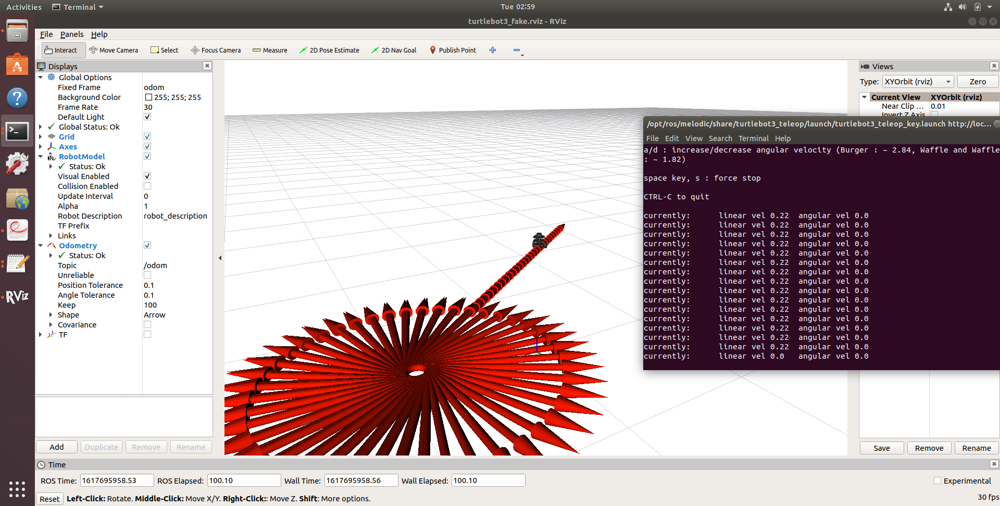
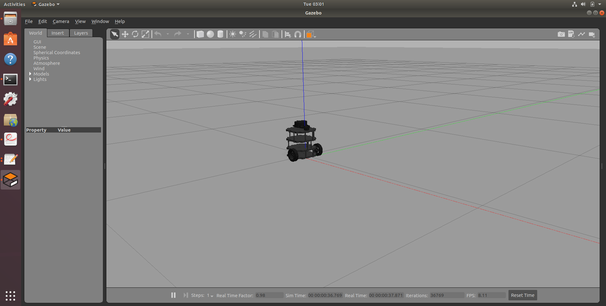
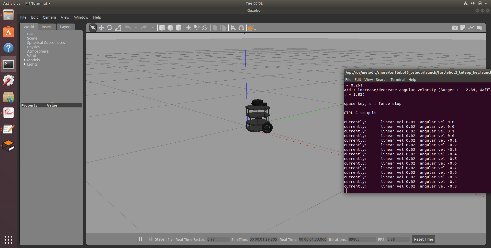
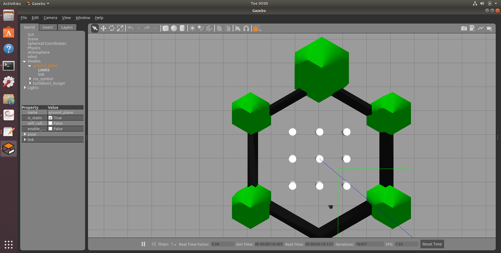

# Turtlbot 3 simulation using RVIZ

In this tutorial, we will learn how to move Turtlebot3 mobile robot platform in a simulation environment. See this week's lecture for more information about the Turtlebot3 robotic platform. 

Then we are also going to run Turtlebot 3 platform in the Gazebo simulation environment. Gazebo is a physics-based simulation environment where we can simulate robots with environmental interactions.

The required packages to simulate Turtlebot 3 (A.K.A Burger) are already installed on your virtual machine.

## Installing the required packages


To install turtlebot3 packages run following commands in a terminal. These steps are essential and need to be run in the following order


* set up keys


 Goto the  melodic installation website from the following link and  run the command in section 1.3 setup key


<http://wiki.ros.org/melodic/Installation/Ubuntu>


Wait until this finishes.

* Then do an update

```
sudo apt-get update

```

* Install turtlebot 3 packages

```

sudo apt install ros-melodic-turtlebot3-*

```
If you get an error you might have to wait until background software update is finished. Also try to restart the virtual machine and try again later.
* Turtlebot model configuration

There are two kinds of model for Turtlebot3. If you don’t choose one of them, the program will not run. For general purpose, we choose to use “burger” model. This need to be setup in the ``.bashrc`` file. Run the following command to do that.

```
echo "export TURTLEBOT3_MODEL=burger" >> ~/.bashrc
source ~/.bashrc


```


## Launching TurtleBot 3 simulation in RVIZ

The TurtleBot 3 RVIZ simulation is created and controlled by the `turtlebot3_fake_node` node. This node generates the model of the TurtleBot in RVIZ and allows for it to be controlled using the Teleop node.

To run the TurtleBot 3 simulation first run the following command.

```
roslaunch turtlebot3_fake turtlebot3_fake.launch
```

This will open Turtlebot3 model in RVIZ. This model is cretaed using URDF definitions as we did in week 3  tutorial for our robotic arm.

Three nodes are started: robot_state_publisher, rviz, and turtlebot3_fake_
node. Then you should see the following screen.


Now let's control the robot using the keyboard. Open a new terminal and run,

```
roslaunch turtlebot3_teleop turtlebot3_teleop_key.launch

```

You can control the robot by using  the following keys 

 * w/x : increase/decrease linear velocity
 * a/d : increase/decrease angular velocity 
 * space key, s : force stop


look at the /odem topic and observe it in RVIZ. This the odometry of the robot.




Next, we will try TurtleBot 3 in the Gazebo 3D simulator. Close all terminal windows before proceeding to the next section


## Launching TurtleBot 3 simulation in Gazebo

Now let's run TurtleBot3 in Gazebo. Run the following command

```
roslaunch turtlebot3_gazebo turtlebot3_empty_world.launch

```

This will open a Gazebo simulation using Tutrlebot 3 as shown in the following figure. You can zoom in and out by pressing the right mouse button.



Now let's move the turtlebot around using the keybord.

Open a new terminal and run'

```
roslaunch turtlebot3_teleop turtlebot3_teleop_key.launch

```

You can control the robot by using keys. You will see now the robot is moving in Gazebo.

 * w/x : increase/decrease linear velocity
 * a/d : increase/decrease angular velocity 
 * space key, s : force stop




Now let us try turtlebot on a challenging environemnt. Use Quit on the Gazebo application from the menu bar and press Ctrl + C in the terminal
window to halt the process


Now, in a new terminal type the following command to spawn the TurtleBot 3 model on the TurtleBot 3 world map:

```
$ roslaunch turtlebot3_gazebo turtlebot3_world.launch

```
This command should produce a screenshot similar to the following:

You can see the Turlebot as a small black circle. Zoom in to (press right mouse button and drag) get a closer look.


To move the robot using the keyboard, launch the `turtlebot3_teleop_key.launch` file as  explained earlier.



## Turtlebot Autonomous Operation

Now let's move the Turtlebot Autonomously.To view this application, hit Ctrl + C in the terminal window running the keyboard teleop process, and close the window. Open a new terminal window run the  the following commands


```
roslaunch turtlebot3_gazebo turtlebot3_simulation.launch

```

This will run the turtlebot in the maze autonomously using laser scanner data. 

Now let's see how  the laser scanner data looks like in Rviz.  The laser scanner sends laser beams around the sensor and measures the distance to nearby objects.  You can see the measurements from each laser beam as a small point marker in Rviz. To see laser data run the following command.


```
roslaunch turtlebot3_gazebo turtlebot3_gazebo_rviz.launch

```

This will show the laser data. You need to add the laser_scan module in Rviz display and configure the `/scan` topic as the input. This is already done.

When the robot moves around you would see that the laser data is changing.


## Moving Turtlebot Autonomoulsy Using Python
In this section let's learn how we can move Turtlebot around in  the Gazebo simulation environment using laser scan data. We need to publish velocity commands to `/cmd_vel` to move the robot. To read the laser scan data the following python code subscribe to the  `/scan ` topic. It is outputting each laser beam's distance to the nearby objects in an array. There are 360 laser beams around the sensor, and therefore there are 360 elements in the array. 0 th element of the array corresponds to the first laser beam located at the front.The following code read the laser scan data from the front, left and right laser beams and try to avoid the obstacle if they are within 0.5 m.

```
cattkin_create_pkg turtlebot3_move rospy sensor_msgs geometry_msgs

```


Then inside the `src` folder create a file called `autonomous_turtlebot.py`  and copy the following code.


 ````
#!/usr/bin/env python
import rospy # Python library for ROS
from sensor_msgs.msg import LaserScan # LaserScan type message is defined in sensor_msgs
from geometry_msgs.msg import Twist # Twist messages for velocity commands


def callback(dt):
    print '-------------------------------------------'
    print 'Range data at 0 deg:' ,dt.ranges[0]
    print 'Range data at 15 deg:', dt.ranges[15]
    print 'Range data at 345 deg:' ,dt.ranges[345]
    print '-------------------------------------------'

    thr1 = 0.5 # Laser scan range threshold
    thr2 = 0.5
    if dt.ranges[0]>thr1 and dt.ranges[15]>thr2 and dt.ranges[345]>thr2: # Checks if there are obstacles in front and
                                                                         # 15 degrees left and right (Try changing the
									                                                       # the angle values as well as the thresholds)
        move.linear.x = 0.2 # go forward (linear velocity)
        move.angular.z = 0.0 # do not rotate (angular velocity)
    else:

        move.linear.x = 0.0 # stop
        move.angular.z = 0.5 # rotate counter-clockwise
        #if dt.ranges[0]>thr1 and dt.ranges[15]>thr2 and dt.ranges[345]>thr2:
            #move.linear.x = 0.5
            #move.angular.z = 0.0
    pub.publish(move) # publish the move object


# Let's create the node publishers and subscribers

rospy.init_node('obstacle_avoidance_node') # Initializes a node

pub = rospy.Publisher("/cmd_vel", Twist, queue_size=10)  
# Publisher object which will publish "Twist" type messages
# on the "/cmd_vel" Topic, "queue_size" is the size of the
# outgoing message queue used for asynchronous publishing


sub = rospy.Subscriber("/scan", LaserScan, callback)  
# Subscriber object which will listen "LaserScan" type messages
# from the "/scan" Topic and call the "callback" function
 # each time it reads something from the Topic


move = Twist() # Creates a Twist message type object to publish velocity commands to the robot


if __name__ == '__main__':
    
      
    try:
        rospy.spin() # Loops infinitely until someone stops the program execution    
    except rospy.ROSInterruptException: pass


````


Try to understand what is happening in the code. Then make it an executable.


Then run the Gazebo simulator by


```
$ roslaunch turtlebot3_gazebo turtlebot3_world.launch

```


Now run the program that you wrote in a new terminal

```
rosrun turtlebot3_move autonomous_turtlebot3.py 

```

You would see that the robot is moving autonomously in the maze.


