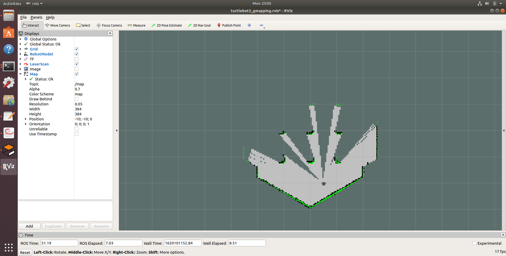
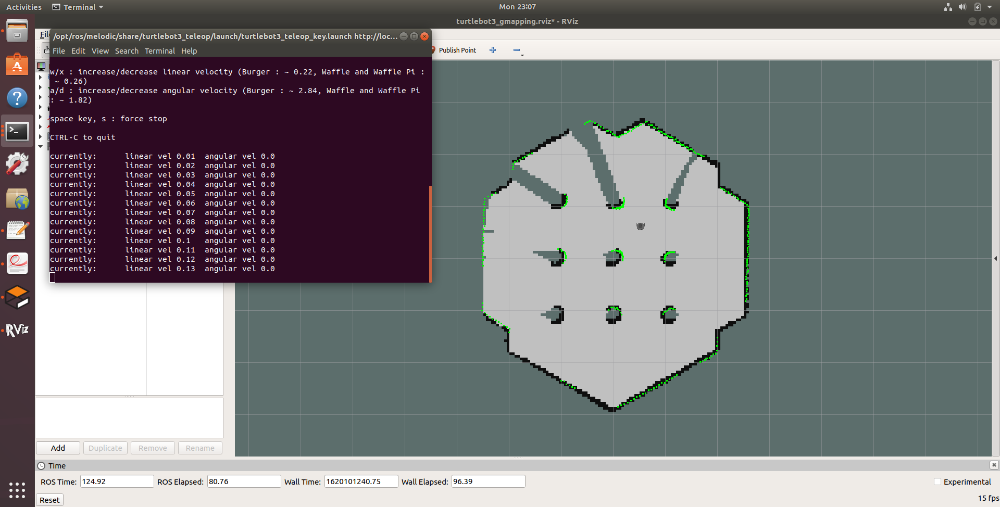
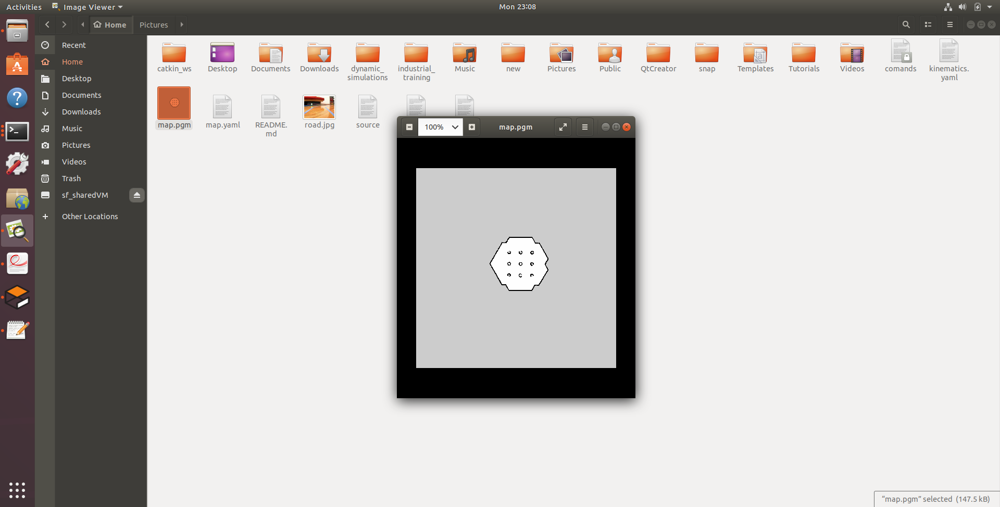
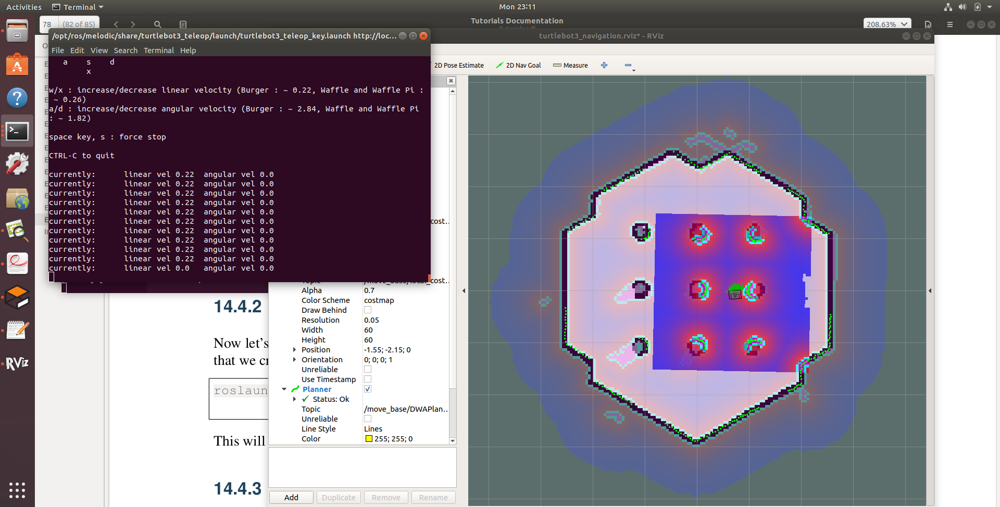

# Turtlebot 3 Autonomous Navigation

In this tutorial, we are going to drive the turtlebot autonomously to a goal location by avoiding obstacles on a given map. You should complete the week 5 tutorial and have installed all the necessary software before trying this tutorial.


# Software installation

We need to install the following additional software packages to run this tutorial. Run the following commands in the terminal to install those ros packages

```
sudo apt-get install ros-melodic-gmapping

sudo apt-get install ros-melodic-dwa-local-planner


```

# Map building

First, we need to create a map. For that, we are going to use ROS inbuilt Simultaneous Localisation and Map (SLAM) building algorithm to build a map. We are going to use Gazebo simulator with Turtlebot 3 to build the map


## Launch Simulation World

In this tutorial, we are going to use the turtlebot3 Gazebo simulation model. In a new terminal run the following command.

```
roslaunch turtlebot3_gazebo turtlebot3_world.launch

```


## Run the SLAM node to generate the Map

Run the following command in a new terminal to launch the Gmapping SLAM node to create a map of the environment.
```
roslaunch turtlebot3_slam turtlebot3_slam.launch slam_methods:=gmapping

```

This will open up a new RVIZ window with robot in it. As you move the robot inside the map, a map will be created.


## Run Teleoperation Node


Now you can run the Teleoperation node to move the robot inside the map using the keyboard keys.


```
roslaunch turtlebot3_teleop turtlebot3_teleop_key.launch

```

Move the  robot using keys until the entire map is created. You can see the built map in RVIZ.


## Saving the Map


Once the entire map is created then you can save the map to a desired location. In the following command, we are saving the map to the home folder. Once saved it will create `.png` file and a `.yaml` file.

In a new terminal run the following command to save the map

```
rosrun map_server map_saver -f ~/map

```


# Navigation Simulation

Now let's move the robot autonomously in the map that we created earlier.

Fist kill all the terminal from the previous excersises.

## Launch Simulation World

Let's run the sumulation world to run the navigation.


```
roslaunch turtlebot3_gazebo turtlebot3_world.launch

```

## Run Navigation Node

Now let's run the navigation node by running the following command in a new terminal. We are reading the Map file that we cretaed earlier.


```
roslaunch turtlebot3_navigation turtlebot3_navigation.launch map_file:=$HOME/map.yaml


```

This will pop up a RVIZ windows with the map and the current laser scans.


## Initial Pos

You would see in the RVIZ window that the initial laser readings do not match with the map. This is because the initial pose (location + orientation) is not correct. The AMCl localisation package needs an initial pose to localise properly. You would see a cloud of small green arrows. These are the possible locations of the robot. If the robot is localised properly this cloud should converge. To do that let's move the robot using teleop node until the location estimates are accurate.

Run the teleop node and move the robot back and forth a bit to collect the surrounding environment information and narrow down the estimated location of the TurtleBot3 on the map which is displayed with tiny green arrows. The map and the laser readings should match.

To run the teleop node run the following command

```
roslaunch turtlebot3_teleop turtlebot3_teleop_key.launch

```



## Set Navigation Goal


**First kill the teleop node** . This is important as we need to command the movement of the robot using the navigation node not by the teleop node.

Now let's set a navigation goal using RVIZ. 

Click the 2D Nav Goal button in the RViz menu.


1. Click on the map to set the destination of the robot and drag the green arrow towards the direction where the robot will be facing.
This green arrow is a marker that can specify the destination of the robot.

2. The root of the arrow is x, y coordinate of the destination, and the angle θ is determined by the orientation of the arrow.
As soon as x, y, θ are set, TurtleBot3 will start moving to the destination immediately.


